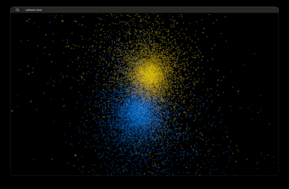

# LuthEngine

**A 3D N body simulator designed to simulate galaxy collisions (eventually)**

  

[//]: # "Badge code, idk why people do this but it looks cool at least"

## Overview

LuthEngine is a gravitational N-body simulator written entirely in C. It approximates the force exerted upon each particle in the simulation, and integrates this to simulate how the particle's positions change over a series of time steps. It uses a Barnes-Hut oct-tree to improve the performance scaling factor from O(N^2) of a naive implementation to O(Nlog(N)). The simulation writes the particle's positions to an output binary file, so that it can be played back either through a lightweight python script using VisPy, or a dedicated OpenGL renderer with various visual effects.

The long-term goal of this program is to simulate large scale galaxy collisions, as at the moment the program can only specify the initial conditions for a naive uniform disk 'galaxy' or a Plummer sphere. And it does not have the necessary optimisations implemented to allow it to simulate a realistic sized galaxy.

## Highlights

-  **Barnes-hut oct-tree**: Using a tree based approximation used to calculate the force between far away and clumped bodies, increasing the execution speed whilst also allowing the degree of the approximation to be accurately specified.
-  **Leapfrog integration**: Using the symplectic Leapfrog integrator instead of the naive Euler integrator in order to better conserve energy over long timescales, and ensure physical accuracy.
-  **Softened gravity**: A constant factor is added to every separation value, in order to prevent the force value blowing up at small separations.
-  **Parallelisation**: Using OpenMP I parallelised the force calculation between bodies.

## Components of the repo

## Physics and algorithms

### Force evaluation

### Gravitational softening

### Integration method

### Initial conditions

### Parallelism

### Memory usage

## Rendering

## Project layout

## Build and run

### Requirements

### Running the software

### Data output format

## Roadmap

## References

## License
